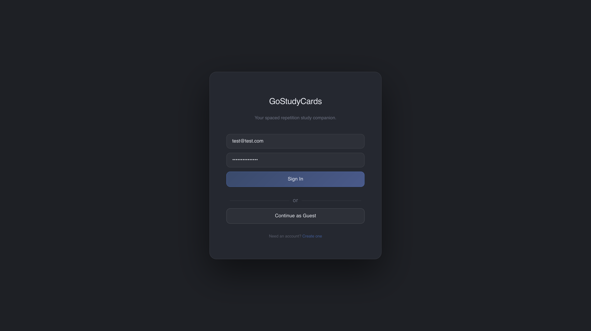
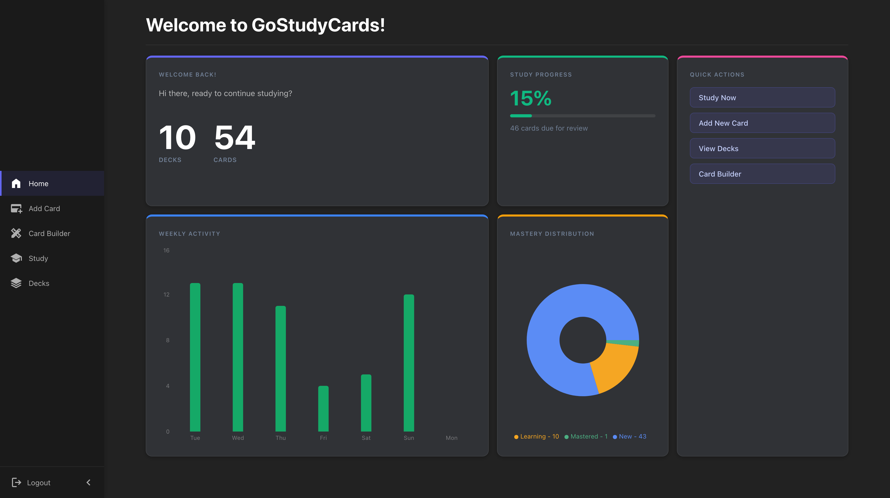
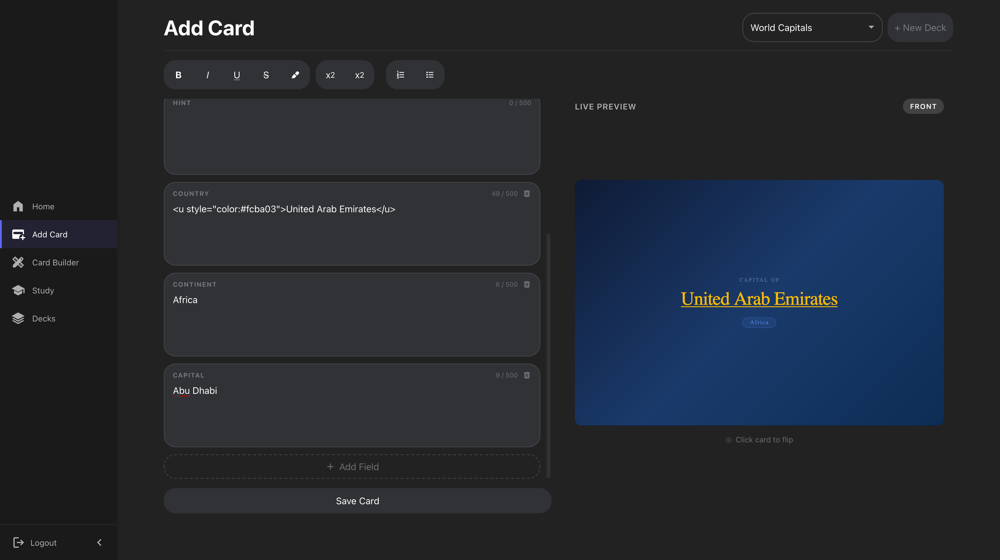
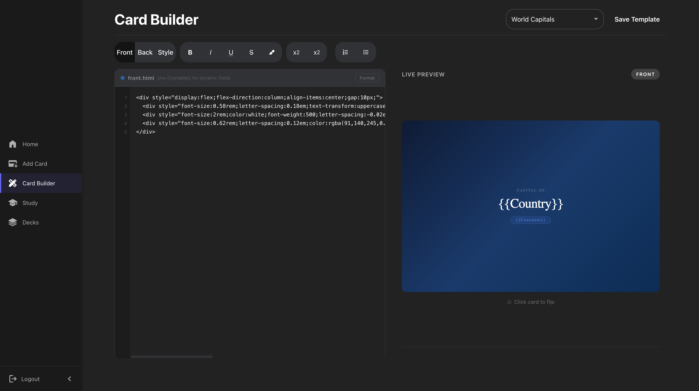
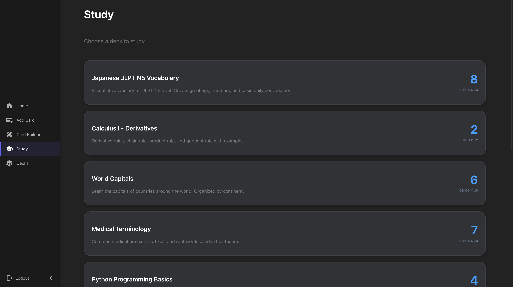
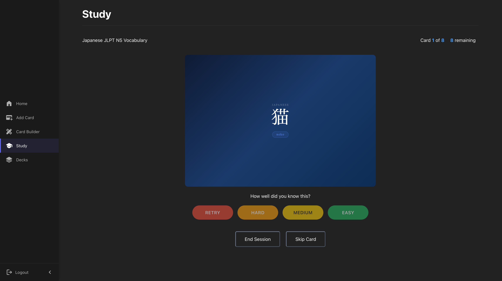
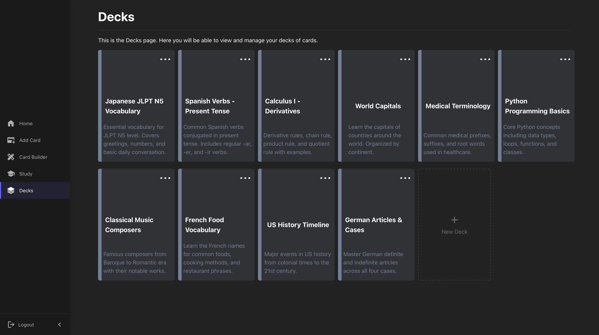
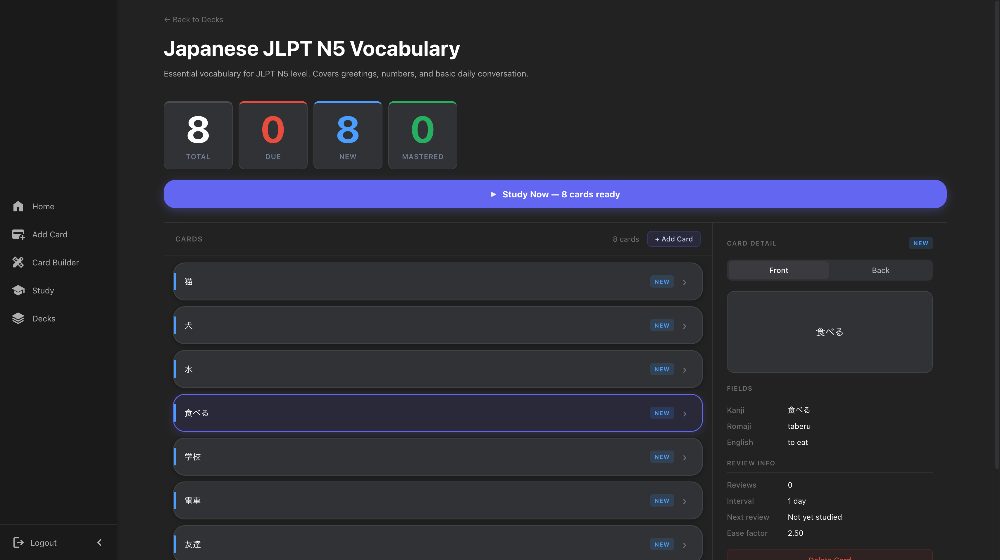

# GoStudyCards

A spaced repetition flashcard app for building and studying custom card decks.

**[Live Demo](https://www.gostudycards.com)** - try it as a guest or create an account

## Features
- **Spaced Repetition** - cards  are scheduled based on how well you know them
- **Custom Card Templates** - build card layouts with HTML/CSS and live preview
- **JWT authentication** - register, login, and persist your decks and progress
- **Guest Mode** - explore the app with pre-loaded sample decks, no account needed
- **Dashboard** - study stats, weekly activity chart, mastery distribution
- **Card builder** - code editor with syntax formatting and live card preview

## Tech Stack

| Layer | Tech |
|---|---|
| Frontend | React, TypeScript, Vite, Recharts |
| Backend | Node.js, Express, Prisma ORM |
| Database | PostgreSQL via Supabase |
| Auth | JWT, bcrypt |
| Deployment | Vercel (frontend), Railway (backend) |

## Screenshots

*Login as authenticated user or try it out with a guest session*

*See a breakdown of your statistics*

*Rich text formatting allows HTML entered in fields to render live in the card preview*

*Build card templates with HTML and CSS, changes apply across all cards in the deck*

*Cards that are due can be seen on the study page, click to start a session*

*Spaced repetition algorithm schedules your next review based on how hard it was to recall the answer*

*View all your decks in one place*

*View all cards within a deck*

## Architecture Notes

- Guest users interact entirely via localStorage with mock data - nothing hits the database
- Authenticated users get full database-backed storage via a REST API
- The SM-2 algorithm runs on the backend for authenticated users and client-side for guests
